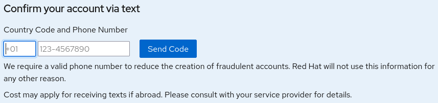
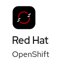
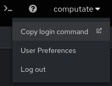

# Cloud sandbox powered by FIWARE

## About the open source GPL3 license and copyright for this product

Copyright (c) 2024 Computate Limited Liability Company in Utah, USA

This program is free software: you can redistribute it and/or modify
it under the terms of the GNU General Public License as published by
the Free Software Foundation, either version 3 of the License, or
(at your option) any later version.

This program is distributed in the hope that it will be useful,
but WITHOUT ANY WARRANTY; without even the implied warranty of
MERCHANTABILITY or FITNESS FOR A PARTICULAR PURPOSE.  See the
GNU General Public License for more details.

You should have received a copy of the GNU General Public License
along with this program.  If not, see <https://www.gnu.org/licenses/>.

ADDITIONAL TERMS

As stated in section 7. c) and e) of the GPL3 license, 
"you may supplement the terms of this License with terms," 
Computate has added the following additional terms to the license: 

  7 c) Prohibiting misrepresentation of the origin of that material, and
    requiring that modified versions of such material be marked in
    reasonable ways as different from the original version;

  7 e) Declining to grant rights under trademark law for use of some
    trade names, trademarks, or service marks;

Please do not redistribute this course until you have built your own platform with these tools, 
separate from the computate.org platform, and reconfigure your fork of this repo to deploy 
your own platform instead of the computate.org platform. 

QUESTIONS

For questions about this open source license, please contact our public mailing list at computate@group.computate.org

# Red Hat OpenShift Developer Sandbox

## How to start an OpenShift Developer Sandbox

Start a [free Red Hat OpenShift Developer Sandbox
here](https://developers.redhat.com/developer-sandbox).


Click on the

button in the top right corner.


### Register for a free Red Hat account

If you do not already have a free Red Hat account, click
.

Log in if you already have a free Red Hat account:


### Start your OpenShift Developer Sandbox

After you are logged into your Red Hat account, return to the page to
start a [free Red Hat OpenShift Developer Sandbox
here](https://developers.redhat.com/developer-sandbox).

Click


Then click


Before you can access your new sandbox, you will need to request an
activation code by phone. Click on the link.

Be sure to enter your country code, and phone number correctly, then
check your phone for the activation code.



Enter your activation code in the box .

After a few moments, you should be able to start your Red Hat OpenShift
Developer Sandbox. Click the button to start your sandbox for free.


If you see a message
,
then click


You can get started in the Red Hat OpenShift platform by clicking on the
button.



Log in by clicking on the

button to log into the new sandbox with your Red Hat account.

Explore your new sandbox with a tour, or get started now.


## Using the OpenShift Developer Sandbox

### Download the oc command
- Click the

button in the top right of the Developer Sandbox.

- Click
.
- Click the download link for your operating system.


- You'll need to extract the `oc` command and place it in your path,
for example in a `bin` directory in your `$HOME` directory.

```bash
mkdir -p ~/bin
tar xvf ~/Downloads/oc.tar -C ~/bin/
```


### Log into the OpenShift CLI in your terminal


- Click your username in the top right corner of the Developer Sandbox.
- Click
.
- Click
.
- Click
.
- Copy the line to the clipboard that looks like this:


- Paste the command into your terminal to log in to the Developer Sandbox in the terminal.


## Switch to the right project

It's important to make sure you are in the right OpenShift project in your terminal. 
All users are granted access to the `openshift-virtualization-os-images` project, but you do not want to use this project. 
Make sure you are using the project with your username ending in `-dev`. 

Run this command to see what projects are available to you, and what project you are currently in (marked by a `*`): 


```bash
oc projects
```

Run this command to switch to your project: 


```bash
oc project $(oc projects -q | grep '.*-dev$')
```

## Next...
If you have successfully ran all of the commands above, congratulations, you are ready to move on to the next notebook in the course. 

- If you have additional questions or issues, please [create an issue for the course here](https://github.com/computate-org/smart-aquaculture-cloud-sandbox/issues). 
- Otherwise, please continue to the next document [01-setup-openshift-ai-workbench.md](01-setup-openshift-ai-workbench.md). 
