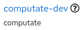
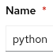

# Cloud sandbox powered by FIWARE

## About the open source GPL3 license and copyright for this product

Copyright (c) 2024 Computate Limited Liability Company in Utah, USA

This program is free software: you can redistribute it and/or modify
it under the terms of the GNU General Public License as published by
the Free Software Foundation, either version 3 of the License, or
(at your option) any later version.

This program is distributed in the hope that it will be useful,
but WITHOUT ANY WARRANTY; without even the implied warranty of
MERCHANTABILITY or FITNESS FOR A PARTICULAR PURPOSE.  See the
GNU General Public License for more details.

You should have received a copy of the GNU General Public License
along with this program.  If not, see <https://www.gnu.org/licenses/>.

ADDITIONAL TERMS

As stated in section 7. c) and e) of the GPL3 license, 
"you may supplement the terms of this License with terms," 
Computate has added the following additional terms to the license: 

  7 c) Prohibiting misrepresentation of the origin of that material, and
    requiring that modified versions of such material be marked in
    reasonable ways as different from the original version;

  7 e) Declining to grant rights under trademark law for use of some
    trade names, trademarks, or service marks;

Please do not redistribute this course until you have built your own platform with these tools, 
separate from the computate.org platform, and reconfigure your fork of this repo to deploy 
your own platform instead of the computate.org platform. 

QUESTIONS

For questions about this open source license, please contact our public mailing list at computate@group.computate.org

# Prepare for using an OpenShift AI Workbench

## Grant default service account edit role in namespace

To grant the default service account edit role privileges, you will use
either your own terminal where you have logged in to OpenShift, or use
the built-in OpenShift Terminal. We will grant edit privileges on the
default service account, as well as edit privileges on roles and
rolebindings in the namespace so that the default service account can
deploy resources in your namespace.


```bash
oc create rolebinding python-edit --clusterrole=edit \
  --serviceaccount=$(oc project -q):python

oc create role python-edit-rolebindings \
  --verb=get,list,watch,create,update,patch,delete \
  --resource=roles,rolebindings

oc create rolebinding python-edit-rolebindings --role=python-edit-rolebindings \
  --serviceaccount=$(oc project -q):python

echo DONE
```

### If the oc command is not working for you

If the oc command is not working for you on Microsoft Windows or MacOSX, 
you can add the required roles and rolebindings directly to the OpenShift Console. 
There a circle button with a plus in the middle for adding resources like this manually. 
Paste this whole yaml file in the box, then click `Save`. 

```yaml
---
kind: Role
apiVersion: rbac.authorization.k8s.io/v1
metadata:
  name: python-edit-rolebindings
rules:
  - verbs:
      - get
      - list
      - watch
      - create
      - update
      - patch
      - delete
    apiGroups:
      - rbac.authorization.k8s.io
    resources:
      - roles
      - rolebindings
---
kind: RoleBinding
apiVersion: rbac.authorization.k8s.io/v1
metadata:
  name: python-edit
subjects:
  - kind: ServiceAccount
    name: python
    namespace: computate-dev
roleRef:
  apiGroup: rbac.authorization.k8s.io
  kind: ClusterRole
  name: edit
---
kind: RoleBinding
apiVersion: rbac.authorization.k8s.io/v1
metadata:
  name: python-edit-rolebindings
subjects:
  - kind: ServiceAccount
    name: python
    namespace: computate-dev
roleRef:
  apiGroup: rbac.authorization.k8s.io
  kind: Role
  name: python-edit-rolebindings
```

## Set up an OpenShift AI Workbench

### Accessing OpenShift AI

In your OpenShift Sandbox, click on the apps button

at the top,

then click

to log into OpenShift AI.

Click the button to
.

Log into OpenShift AI by clicking on the

button.

Once you are in OpenShift AI, click on the menu button
,
then click
.

Then click on the name of your data science project
,
for my Red Hat user it’s computate-dev.


### Create a new OpenShift AI Workbench

To create a new workbench, click
.

To stay consistent with the rest of the course, enter the workbench name
“python”
.

For Image selection, choose “Minimal Python”
.

You can leave the rest of the fields as the default. At the very bottom,
click
.

After a minute or two, you should see the workbench change from

to
.


### Access your OpenShift AI Workbench

In OpenShift AI, click on the

link to open your new OpenShift AI Workbench.

Log into OpenShift AI by clicking on the

button.

You will need to authorize yourself access to your workbench. Click
.

## Using an OpenShift AI Python Workbench

### Using a Workbench Terminal to load course resources

You will want to open a Terminal inside your OpenShift AI Workbench to
load the course resources. There are many ways to open a terminal, but
here is one that always works.

At the top, click

→

→
.


### Rsync the cloud-sandbox-powered-by-fiware course to your workbench

With the `oc rsync` command, copy the course materials to the default home directory
(/opt/app-root/src) of your workbench.

```bash
oc rsync ~/Downloads/cloud-sandbox-powered-by-fiware/ python-0:/opt/app-root/src/cloud-sandbox-powered-by-fiware/
```

## Next...
From now on, you can access the rest of the Jupyter Notebooks in your OpenShift AI Workbench. 
If you have successfully ran all of the commands above, congratulations, you are ready to move on to the next notebook in the course. 

- If you have additional questions or issues, please [create an issue for the course here](https://github.com/computate-org/computate/issues). 
- Otherwise, please continue to the next document [01-install-prerequisites.ipynb](01-install-prerequisites.ipynb). 
